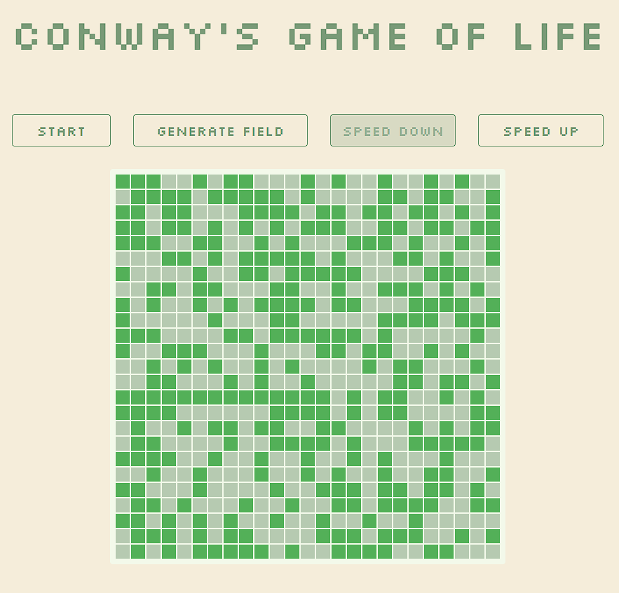

# Elm Conway's Game of Life

Elm Conway's Game of Life implementation



## Demo

[Click here for a live preview](http://conways-life-elm.surge.sh/)

## Project setup

In the project directory, you can run:

```
elm install
yarn 
# or npm install 
```
### Tech stack
Here's a brief high-level overview of the tech stack the app uses:

* elm 0.19
* webpack 5
* tailwindcss 3

### Compiles and hot-reloads for development

```
yarn dev
# or npm dev
```

Open [http://localhost:3000](http://localhost:3000) to view it in the browser.

The page will reload if you make edits.

###  Building the Project
You can build the project by running:

```
yarn build
# or npm build
```
This will generate the compiled files in dist folder.

## Further reading
*  [Conway's Game of Life](https://en.wikipedia.org/wiki/Conway%27s_Game_of_Life) 
